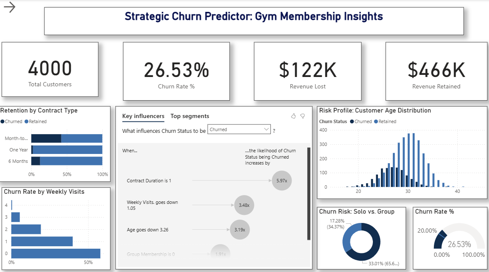
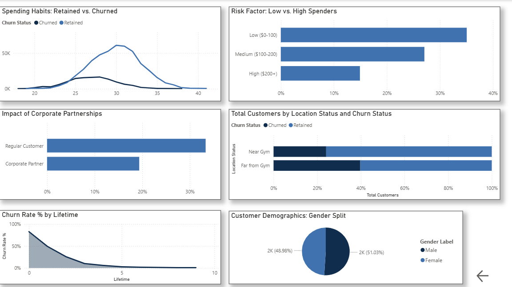
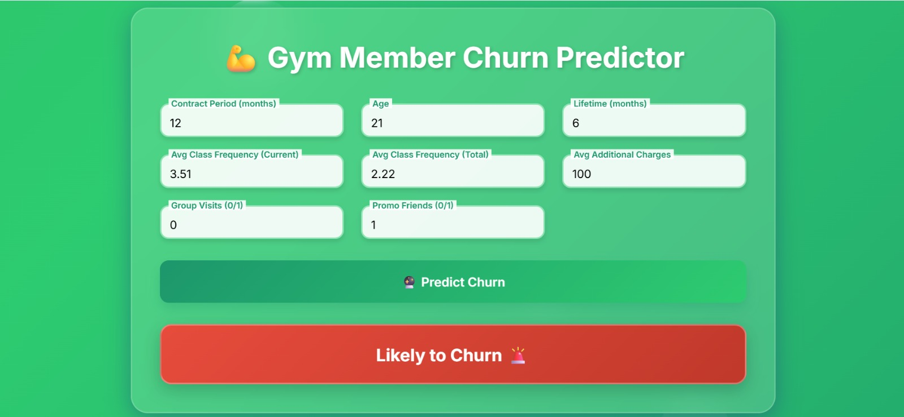
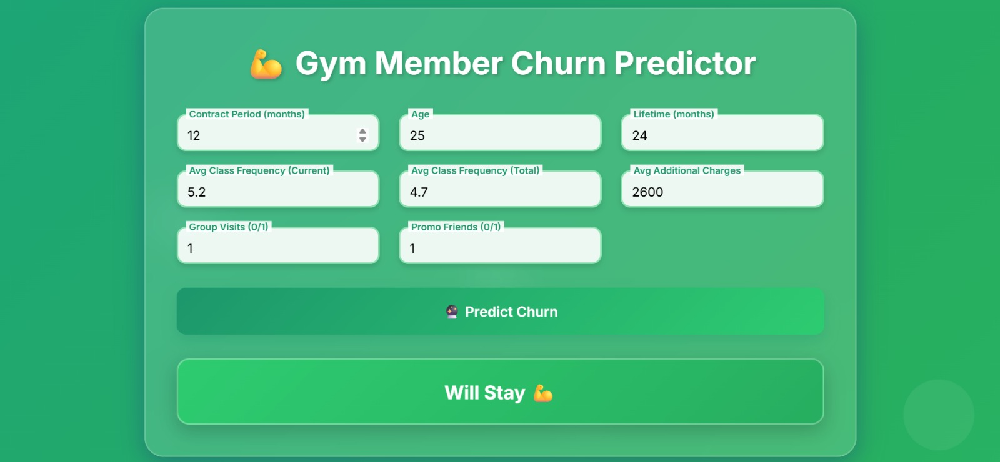

# 🏋️‍♂️ Strategic Churn Predictor: Gym Membership Insights

### A Data Intelligence System to Predict & Prevent Customer Churn

This project is an end-to-end data solution designed to help gym management reduce customer attrition. It combines a **Power BI Dashboard** for strategic analysis with a **Machine Learning Web Application** for real-time churn prediction.

---

## 📊 Part 1: Power BI Dashboard
*An executive-level view of customer retention, financial impact, and churn risk factors.*

### 1. Executive Summary & Key Influencers (Page 1)
Key Performance Indicators (KPIs) showing Total Customers, Churn Rate (26.5%), and Revenue Impact. The "Key Influencers" visual automatically identifies that **Contract Duration** and **Weekly Visits** are the top drivers of churn.

### 2. Segment Analysis (Page 1 - Top Segments)
A deeper look into the specific customer groups with the highest risk. This view highlights the "Top Segments" identified by AI, such as members with **Month-to-Month contracts** who visit **less than once a week**.

### 3. Financial & Demographic Analysis (Page 2)
Deep dive into customer spending habits, corporate partnerships, and demographics. This page reveals that **loyal customers significantly outspend churned users** on additional services, validating the importance of retention.

---

## 🤖 Part 2: Churn Prediction System (Web App)
*A machine learning tool built to predict the probability of a specific member leaving.*

### 1. User Interface
The user enters member details such as **Age**, **Contract Period**, **Weekly Visits**, and **Spending**.

### 2. Prediction Result
The model returns a "Churn" or "Retain" prediction along with a probability score, allowing staff to intervene immediately.

---

## 💡 Key Business Insights
Based on the analysis of 4,000 customers, the following patterns were identified:
* **Contract Risk:** Customers on **Month-to-Month** contracts are **5.9x more likely to churn** than those on 1-year contracts.
* **Social Factor:** Members who attend **Group Classes** or come with friends have a significantly higher retention rate.
* **Attendance Warning:** A sharp drop in attendance to **<1 visit/week** is the strongest early warning signal for churn.
* **Financial Impact:** Retained customers spend **2x more** on additional services (smoothies, gear, training) compared to those who leave.

## 🛠️ Tech Stack
* **Data Visualization:** Microsoft Power BI (DAX, Data Modeling, AI Visuals)
* **Machine Learning:** Python (Scikit-Learn, Pandas, NumPy)
* **Web Application:** Streamlit / Flask
* **Data Processing:** SQL / Excel

## 🚀 Future Scope
* **Integration:** Connect the Prediction App directly to the gym's CRM to flag at-risk members automatically.
* **Automated Emails:** Send personalized discount offers to members identified as "High Risk" by the model.

---
### 👤 Created by [Danish Jain](https://www.linkedin.com/in/danish-jain-6b9261316)